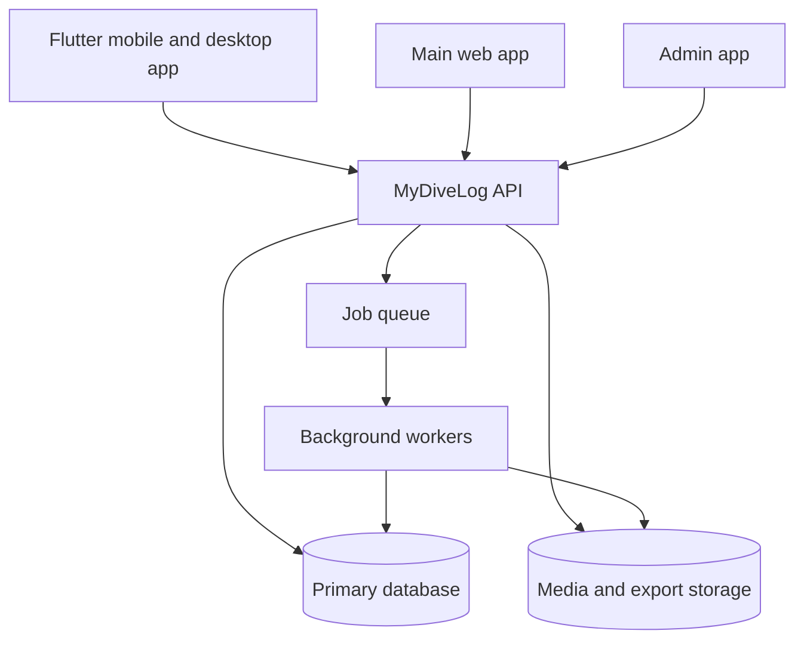

# System Architecture

## High-Level Shape

MyDiveLog should be built as a set of separate layers:

- Database layer: persistent domain data, migrations, indexes, and database constraints.
- API layer: authenticated domain API used by all client apps.
- Web app: primary browser experience for onboarding, import/export, account management, and log review.
- Flutter app: mobile and desktop app with offline-first local storage and sync.
- Admin app: internal staff tooling for support and operations.
- Background workers: imports, exports, media processing, notifications, and cleanup.

## Recommended Foundation Stack

These are planning recommendations, not final commitments:

- Primary database: PostgreSQL on Cloud SQL.
- API: TypeScript/Node service using NestJS.
- API contract: OpenAPI generated from the server or maintained alongside handlers.
- Auth: direct external OAuth/OpenID Connect identity, starting with Google and Apple. Do not store user passwords in the initial product.
- Hosting/provider baseline: Full GCP Lean.
- Runtime: Cloud Run for API, web/admin containers, workers, and jobs.
- Database: Cloud SQL for PostgreSQL, with `db-g1-small` production and `db-f1-micro` staging/dev as the starting shape.
- Database access: Prisma.
- Background jobs: Cloud Tasks with Cloud Run jobs or worker services.
- Object storage: Cloud Storage for imports, exports, attachments, and future media.
- Secrets: Secret Manager.
- Observability: Cloud Logging, Monitoring, and Error Reporting.
- Flutter local storage: SQLite via Drift or another migration-friendly persistence layer.
- Web and admin apps: separate Next.js apps, separate Cloud Run deployments.
- Package manager/task runner: pnpm workspaces with Turborepo.
- Infrastructure as code: Terraform.
- CI/CD: GitHub Actions.

## Service Boundaries

Keep the first backend as a well-modularized monolith instead of many microservices. The product is still defining its domain, and strong internal boundaries will provide most of the benefits without distributed-system overhead.

Suggested backend modules:

- Identity and accounts.
- Dive log.
- Locations and dive sites.
- Gear.
- Gas mixes.
- Imports and exports.
- Sharing and visibility.
- Sync.
- Admin and audit.

## Environments

At minimum:

- Local: local database, object storage emulator, local queue.
- Preview: per-branch or per-PR deployments once CI exists, likely custom GitHub Actions plus Cloud Run preview services.
- Preview scope: web/admin previews first, pointing at staging API/database; API previews later if needed.
- Staging: production-like environment for migration and sync testing.
- Production: monitored, backed up, and isolated.

## Cross-Cutting Requirements

- Every user-owned row must carry an owner ID or tenant boundary.
- Every mutable syncable row should carry stable IDs, timestamps, deletion markers, and revision metadata.
- API responses should be explicit about units.
- All writes should be idempotent when possible, especially sync and import.
- Data export should be available early so trust is built into the system.
- Admin access must be audited.
- Public dive pages must expose only fields intentionally approved for anonymous viewing.

## Observability

Track:

- API latency, errors, and request volume.
- Sync success rate, conflict count, and payload sizes.
- Import success/failure rate by format.
- Background job duration and retries.
- Database query performance.
- Admin actions and support access.

## Security Baseline

- TLS everywhere.
- No password storage in the initial product. Use external identity providers for user authentication.
- Google and Apple sign-in for customer accounts.
- Implement provider auth directly in the API unless a managed service becomes clearly necessary.
- Consider passkeys later as a passwordless first-party option.
- Short-lived access tokens plus refresh tokens or secure session cookies.
- Separate admin app deployment, preferably on a staff-only subdomain.
- Role-based admin access with least privilege.
- Audit logs for sensitive admin operations.
- Rate limits on auth, import, export, and sync endpoints.
- Backups with restore tests.
